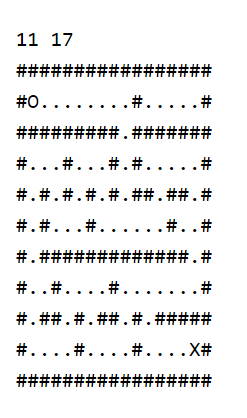

# To Find The Shortest Way Out of A Maze.

This task is to find the shortest way out of a maze by using graph.

# Your tasks :
1) The first line of input is number of row and column of the maze respestively

2) Draw the wall by using '#' symbol

3) Initial your starting point by using 'O'

4) Initial the way out of the maze by using 'X'

5) Draw the path that you can walk by using '.'

For example :

6) Program will show steps and the way of the shortest path to get out of the maze.
